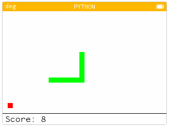

# Snake

Ceci est un jeu de Snake pour la calculatrice Numworks.

Ce jeu nécessite la version 13.1.0 ou supérieure d'Epsilon (détection des touches de clavier appuyées).

## Fonctionnalités

- Réglages du jeu en mode textuel
    - Vitesse
    - Mode blanc/noir
    - Taille des cases (4, 5, 8 ou 10 pixels)

## À venir

- Amélioration de la pause
- Jeu allégé au maximum